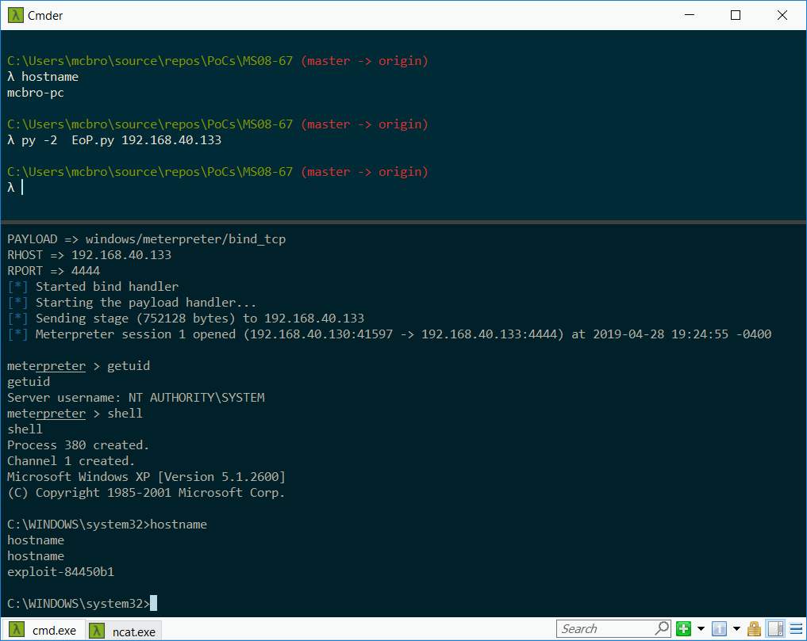

# MS08-67
Remote Code Execution code for MS08-67.

### RCE for Windows XP SP2 x86 English

### Notes

The RPC locator service needs to be enabled on the host, otherwise a remote host will not be able to resolve the SRVSVC uuid.
If the locator service is disabled, it can be enabled in the `services.msc` GUI: 
* [How to Start/Stop RPC Locator Service](https://computerstepbystep.com/remote_procedure_call_(rpc)_locator_service.html)

### Links

* [Microsoft Security Bulletin MS08-067](https://docs.microsoft.com/en-us/security-updates/securitybulletins/2008/ms08-067)
