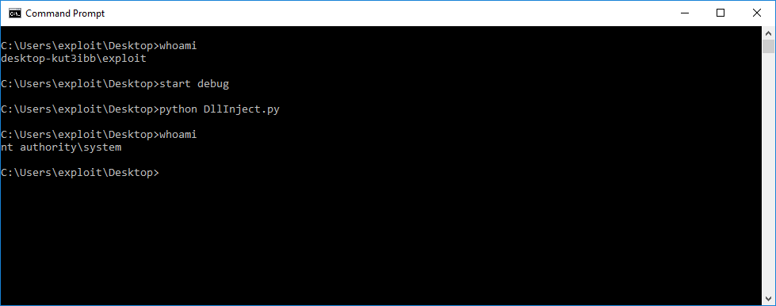

# Google Project-Zero Issue 1391
Elevation of Privilege (to SYSTEM) code for Google Project-Zero Issue 1391.

### EoP to SYSTEM on Windows 10 1703 x86

### Notes

SMEP needs to be disabled for the the host, otherwise a Bug Check 0xFC (ATTEMPTED_EXECUTE_OF_NOEXECUTE_MEMORY) will occur.
If SMEP is enabled, it can be disabled in a kernel debugger with the command: 
* `r @cr4=@cr4 - 0x00100000`

### Links

* [Disclosure by Matthew "j00ru" Jurczyk](https://bugs.chromium.org/p/project-zero/issues/detail?id=1391&can=1&q=&sort=-id)
